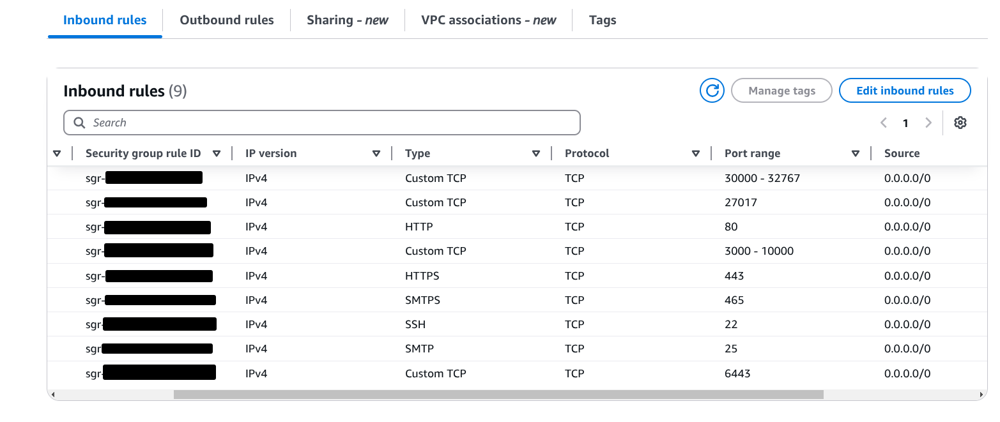

# Creating a custom Kubernetes cluster

This guide seeks to help you create a multinodal self administrated kubernetes cluster using `aws` ec2 instances. Credit to the [Sander Van Vugt CKA program](https://www.sandervanvugt.com/course/certified-kubernetes-administrator-cka-video-course/) for the scripts used in this guide. The creator Mr Sander Van Vugt provides excellent resources for studying the CKA and other kubernetes certification exams.

Now, onto the configurations.

### Your Security Group(s)
You can create one catch-all security group to be used by both master and worker nodes. See the image below for the port ranges and associated protocols you will need:


>Note: Additional Credit to the [DevOps Shack Youtube Channel](https://youtu.be/FTrTFOLbdm4?si=HHDg4zzMIvjezHVa). I got this security group configuration from the youtube video I just linked. The video is for Github Actions CICD pipeline to a kubernetes cluster.

## Creating Cluster Nodes
These are the following servers and their roles:
- One Master Node
- Two Worker Nodes

>Note: For the servers, you can easily spin up t3.small instances on aws for all of them. Though if you want specific minimum viable requirements, see below.

### Master Node Requirements
- OS: Ubuntu
- RAM: 2GB or more
- CPU: 2CPUs or more

### Worker Nodes Requirements
- OS: Ubuntu
- RAM: 2GB or more
- CPU: Could be less than 2CPUs if you want.

It feels redundant to say, but they should all be in the same VPC.

## Installing Cluster Resources
Run everything in this subsection on all nodes.

Update and install necessary tools:
```
sudo apt update
sudo apt install -y git nano 
```

Clone the sandervanvugt/cka github repository:
```
git clone https://github.com/sandervanvugt/cka.git
```

Run scripts to install container-runtime and kube tools:
```
cd cka/
sudo ./setup-container.sh
sudo ./setup-kubetools.sh
```

## Starting the cluster
Open port 6443 on the sg of the control-node
> Note: This is already opened if you followed the catch-all sg configuration earlier.

On the control node, run the following:
```
sudo kubeadm init
```

Once successful, execute the following commands to give you admin control of your cluster:
```
mkdir -p $HOME/.kube
sudo cp -i /etc/kubernetes/admin.conf $HOME/.kube/config
sudo chown $(id -u):$(id -g) $HOME/.kube/config
```

-----------------------------------------
## Installing a Network add-on
On the control node, run the following:
```
kubectl apply -f https://docs.projectcalico.org/manifests/calico.yaml
```
-------------------------
## Joining the other nodes to the cluster
On the worker nodes, run the following, or something similar, which will be the output from the initial `kubeadm init` command
on the control plane:
```
sudo kubeadm join 172.31.23.4:6443 --token xx6u0r.k84lw9i5qspe2vbc \
	--discovery-token-ca-cert-hash sha256:75c67cf0f7cd5adce9bc5cd69a04c65a3d875439d237cb404848668eec2611ba
```


-------------------------------------
## Kubernetes Nginx-Ingress Controller
Optionally sometimes you might have to install the Nginx-Ingress Controller.
On your master node, you'd use this command:
```
kubectl apply -f https://raw.githubusercontent.com/kubernetes/ingress-nginx/controller-v1.12.0/deploy/static/provider/baremetal/deploy.yaml
```
